# Exercise Workflow
This page describes the process for working on exercises at Boolean. There are two main types of exercise: 

1. Afternoon exercises that put in to practice the theory you learn in morning lectures. There will usually be an afternoon exercise each day.

2. Larger challenge exercises that take place across multiple days and allow you to test your understanding of the material covered so far. There will be one or two of these per learning unit.

For both types of exercises, you are required to perform the following steps:

1. [Fork the repository](#fork-the-repository)
2. [Clone the fork](#clone-the-fork)
3. [Work on the project in VS Code](#work-on-the-project-in-vs-code)
4. [Push your changes](#push-your-changes)
5. [Your pair clones your repo](#pair-clones-repo)
6. [Your pair works on the project](#pair-works-on-project)
7. [Your pair pushes the changes](#pair-pushes-changes)
8. [Your pair forks your repo](#pair-forks-your-repo)
9. [Create pull request](#create-pull-request)

When given an exercise of either type, you will be provided with a link to a GitHub repository that contains the exercise instructions and any template code. 

Prior to following this guide you should have:

1. Signed up to a GitHub account
2. Been added to the relevant GitHub team for your Cohort (your instructor can invite you)
3. Have installed Git on your development machine
4. Have setup and configured SSH Keys

## 1. Fork the repository
The first step is **fork** the repository. You can do this from the repository page in GitHub by pressing the **fork** button in the top right corner:

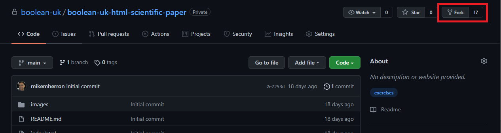

Forking the repository takes a copy of the repository and adds it to your own GitHub account.

If you cannot see the exercise page or get an error trying to access it, contact your instructor. The cause is likely to be one of the following:

* You are not signed in to your GitHub account
* You have not been added to the GitHub team for your cohort
* The Cohort GitHub team has not been given access to the repository

## 2. Clone the fork
One the repository has been forked, you then *clone* the repository to your local machine. Cloning takes a copy of the repository from GitHub and stores it on your local machine so you can start working on it.
 
To clone the repository, go to the *forked* repository page in GitHub. This is the copy of the repository that should exist on your own GitHub account. You can verify you are looking at the forked copy by checking for the message underneath the repository name:

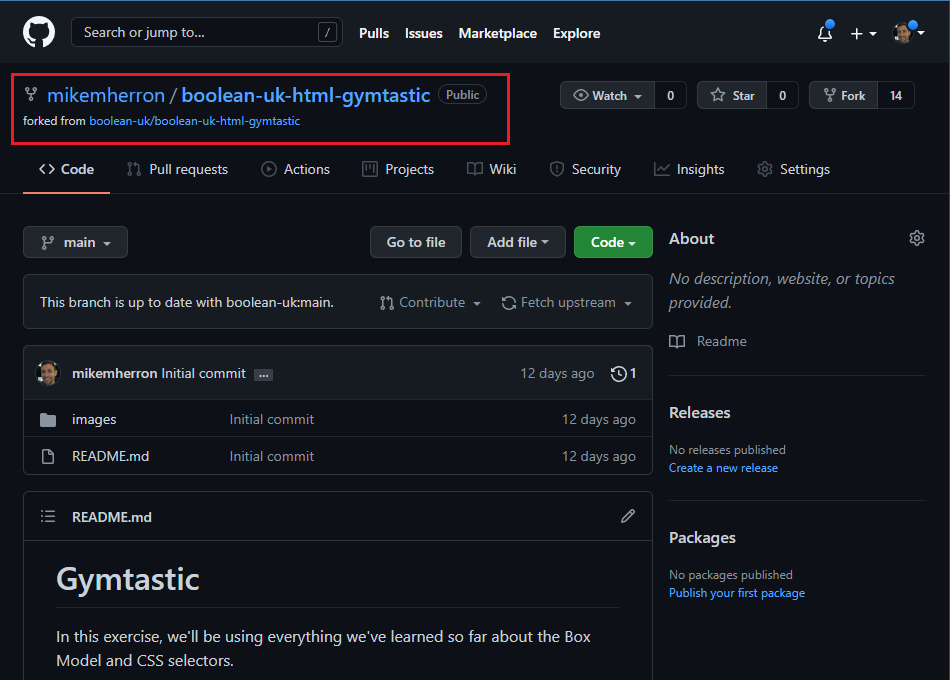

From here, we want to press the green code button, then select the `SSH` tab, and then the copy icon to copy the repository SSH URL to the clipboard:

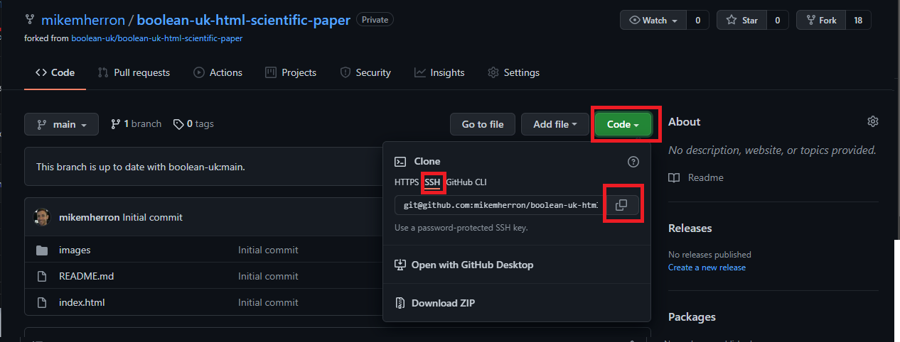

The repository SSH URL is what we need to provide to the Git command on our local machine to do the clone.

Once this is copied, open up your terminal on Mac or GitBash on Windows. Navigate to the directory where you want to repository code to be cloned to and then use the `git clone` command with the copied SSH url (you should be able to right-click in your terminal to paste the url you copied) to clone the repository. Here is how it should look on GitBash on windows:

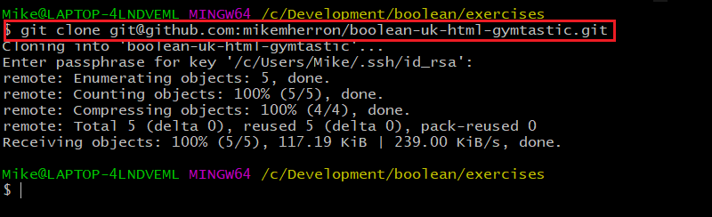

Once this command completes, you now have a copy of the repository on your local machine. You're now ready to start working on the exercise.

## 3. Work on the project in VS Code

Open VS Code and select the "Open Folder" option:

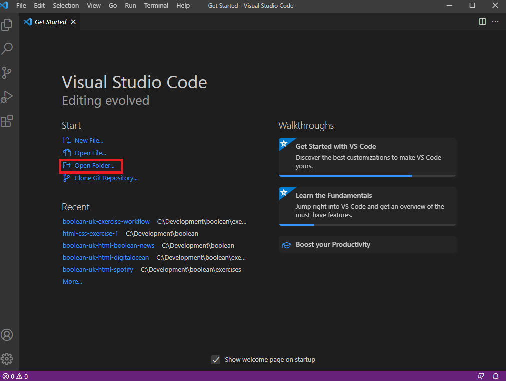

Then navigate to and select the folder where you checked out the repository. You are now able to work on the exercise using VS Code.

## 4. Stage and commit your changes

Once you are ready to commit your changes there are a couple of steps to follow.

First, we need to tell Git what changes we want to include as part of the next commit. In git terminology, this is known as *staging* our changes. We *stage* our changes prior to committing them using the `git add` command. 

If you are unsure what files you've changed, you can run the `git status` command from your repository root to view the current state of your repository.

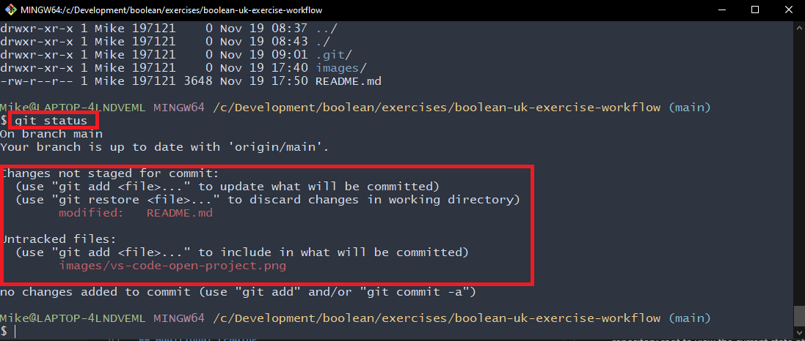

In this example, git is telling us we have 2 changes that have not yet been staged - we've modified the `index.html` file and also added a new `styles.css` file. In this case, we want both of these changes to be included in our next commit, so we *stage* them using `git add`:

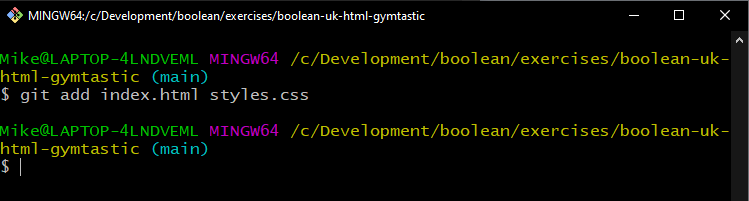

Once we've done this, we use `git status` again to check the current state of our local repository:

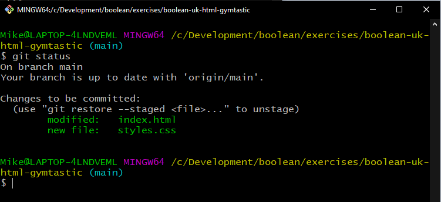

This shows us our changes are now staged and ready to be committed. We now use `git commit -m "<commit message>"` to actually commit our changes, replacing `<commit message>` with a short description of what the commit contains:

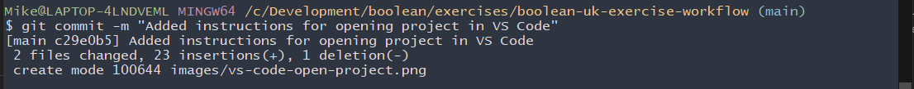

At this point **our commits are still on our local repository only**! 

## 5. Push your changes
The next step is to *push* our commits to the remote repository - i.e your own fork of the exercise repository on GitHub. This enables the instructors to review your work and, when you come to the group projects, will also allow your team mates to incorporate your changes in to their copy of the repository.

Before we push our changes we can use `git status` to check if we have any commits that have not yet been pushed:

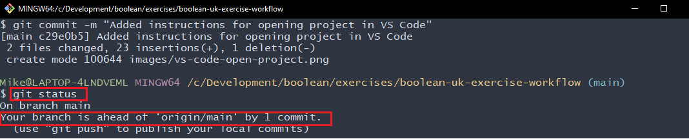

In this case, git tell us us we have 1 commit that has yet to be pushed - `Your branch is ahead of 'origin/main' by 1 commit` just means that our copy of the repository has 1 commit that the remote repository does not yet have (`origin` is the label of the remote repository and `main` is the branch we are working in. We'll come back to these concepts in more detail later in the course).

When we're ready to end our commits to the remote repository we use `git push`:

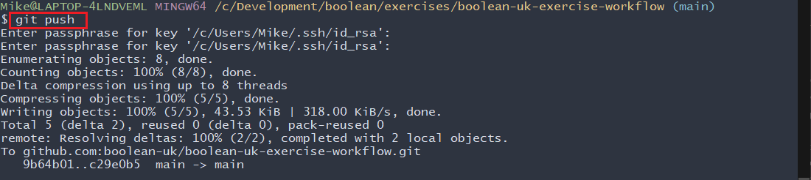

Once the push command completes, your changes now existing on the remote repository (i.e. the fork of the exercise repository that exists on your own GitHub) account. You can also verify this by going back to GitHub and checking the commit history of your repository. First select the "clock" icon from the repository home page:

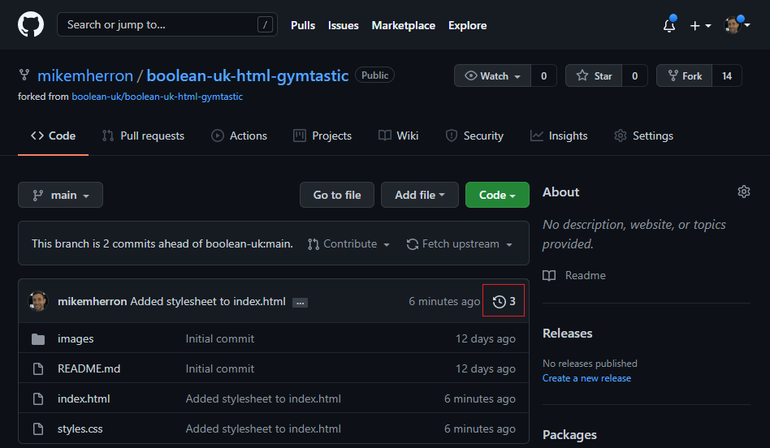

This takes you to the commit history of the repository:

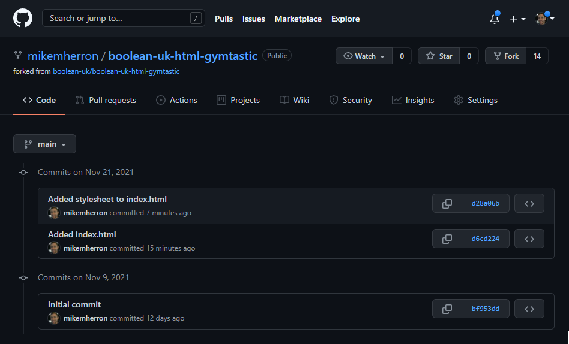

From here you can see a timeline of every commit pushed to the repository, who made the commit, and you can also click on the commit to view the line-by-line changes on each file.

...and that's it! There is more to learn on Git, but for now these are the basic commands you need to start working on afternoon exercises.

## 5. Pair Clones Repo
1. Send your pair the URL to your GitHub repo (e.g. https://github.com/your_user_name/student-submission-workflow) , or the SSH link that you use to clone (e.g. git@github.com:your_user_name/student-submission-workflow.git)
2. They can then run `git clone` to clone your repo to their laptop.

## 6. pair works on project
1. As per the previous example of making changes in VS Code, your pair now makes changes to the code base, then stages (`git add .`) and commits (`git commit -m 'write a useful message here'`).

## 7. Pair pushes changes
1. The pair can then run `git push`.

## 8. Pair forks your repo
Once you are happy that you have completed all changes to the codebase (and everyone has pushed their code to your repo) then the pair can FORK from your repo (do not fork from the original Boolean-UK repo).

## 9. Create Pull Request
Once you have finished a challenge exercise and are ready for it to be reviewed, you should create a *Pull request* (sometimes shortened to "PR") in GitHub back to the original repository you created the fork from (also know as the "upstream repository"). 

In a "real" project, a Pull Request is used to request that your changes be reviewed and merged in to a repository. For challenge exercises, your changes will not actually be merged but we'll use the Pull Request workflow as a way to provide you with feedback on your submission. Creating a Pull Request will also notify the instructions your submission is ready to be reviewed.

Once your changes are ready to be reviewed, from the GitHub paged of your forked repository, select "Contribute", and then the "Open Pull Request" button.

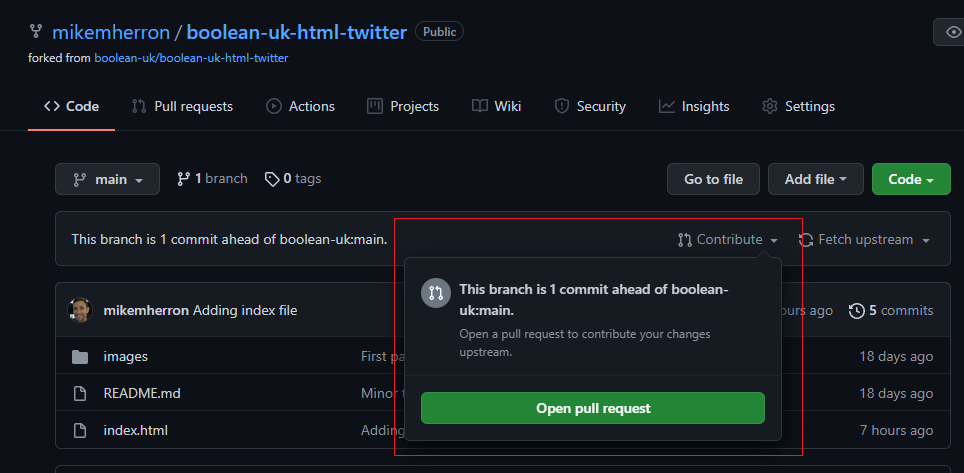

The next screen shows a summary of all the changes you have made. From here, select "Create Pull Request":

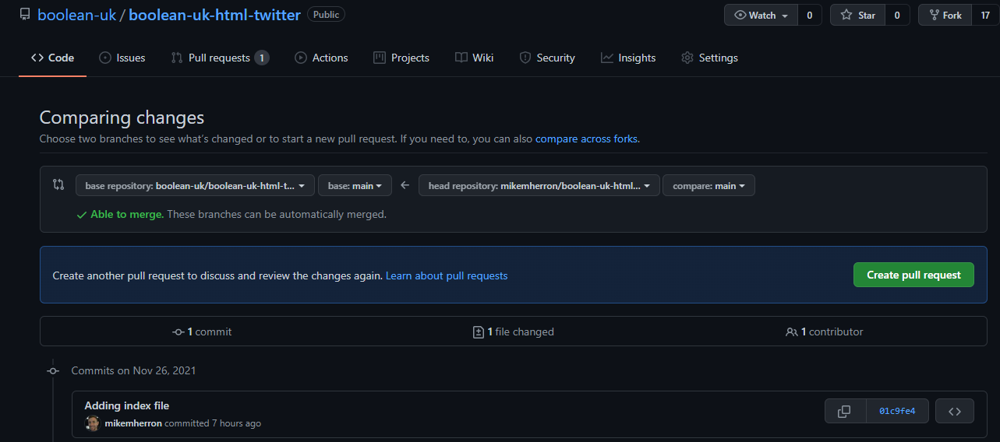

Next, you can provide a title and any additional notes you want to provide to the instructors on your implementation. You should set the title to "Exercise Completed" (or something along those lines). 

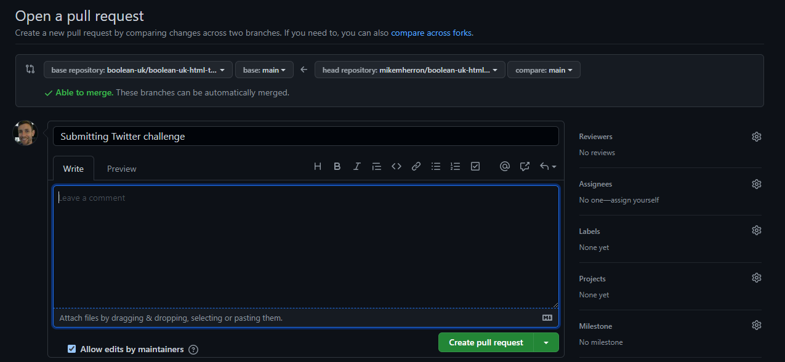

Select the "Create Pull Request" button - and that's it, you're done!

## FAQs

### How often should you commit changes? 
This depends. If you Google that question you'll find a lot of different answers. Generally, committing on every minor change is probably overkill, and committing once per day is not often enough. A commit should encapsulate a small but meaningful change and represent some progress towards your end goal. A commit every 15-60 minutes is probably typical. Commits should also be *atomic* i.e. a single commit should encapsulate everything required to understand and implement a specific change. For example, if we update a `
` element in our HTML to add a `class` attribute and we then add some CSS rules for that class in our stylesheet, both of those changes should probably be part of the same commit.

### How can I check I'm pointing to the correct remote repository?
You can use the `git remote -v` command to list the remote repositories linked to your local repository:

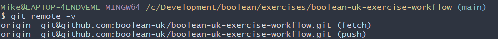

If the repository *isn't* what you expect, then it's likely that you cloned from the wrong place (the default remote is always where you cloned from). If this happens, let an instructor know and they'll work with you to resolve the issue.
